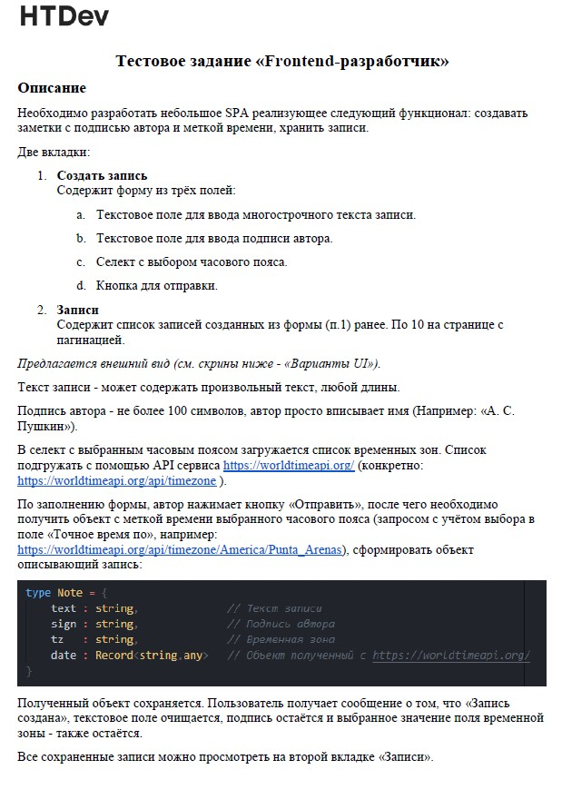
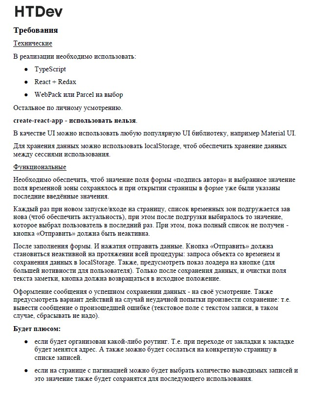
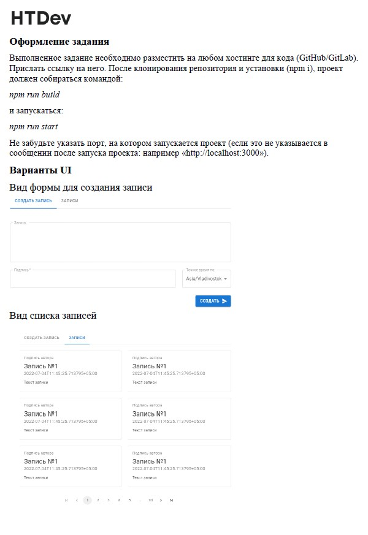

# Тестовое задание для компании HTDev

### Необходимо разработать небольшое SPA реализующее следующий функционал: создавать заметки с подписью автора и меткой времени, хранить записи.

### В реализации необходимо использовать:

- TypeScript
- React + Redux
- WebPack или Parcel на выбор.
- Остальное по личному усмотрению.
- create-react-app - использовать нельзя! (но я не senior помидор и настраивать
  webpack еще не умею, поэтому сделаю с CRA :) )

---

## Клонируем репо:

```
npm install / npm i
```

## и:

```
npm start
```

---

[> Ссылка на деплой <](https://vagoalex.github.io/HTDev-test-task)

[> Ссылка на репо <](https://github.com/Vagoalex/HTDev-test-task)

### Коротко о задании:

 

